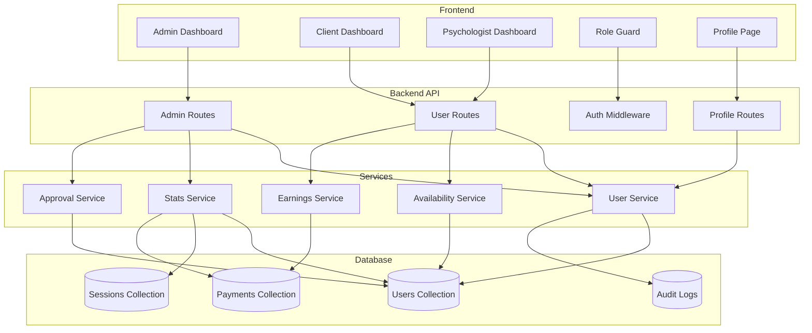

# Design Document: Admin & User Management

## Overview

This design document specifies the architecture and implementation details for the admin dashboard, user management, profile management, and role-based access control features. The system integrates with the existing Node.js/Express backend with MongoDB database and React frontend.

## Architecture



## Components and Interfaces

### Backend Components

#### 1. Admin Routes (`/api/admin`)

```javascript
// GET /api/admin/stats - Dashboard statistics
{
  totalClients: number,
  totalPsychologists: number,
  totalSessions: { pending: number, approved: number, confirmed: number, completed: number, cancelled: number },
  totalPayments: { count: number, amount: number },
  pendingApprovals: number
}

// GET /api/admin/users - List all users with pagination
// Query params: page, limit, search, role, status
{
  users: User[],
  total: number,
  page: number,
  pages: number
}

// GET /api/admin/users/:id - Get user details
// PUT /api/admin/users/:id/status - Update user status (active/inactive)
// DELETE /api/admin/users/:id - Soft delete user

// GET /api/admin/psychologists/pending - List pending approvals
// PUT /api/admin/psychologists/:id/approve - Approve psychologist
// PUT /api/admin/psychologists/:id/reject - Reject psychologist with reason

// GET /api/admin/payments - List all payments with filters
// GET /api/admin/payments/export - Export payments as CSV

// POST /api/admin/sessions/book - Create booking on behalf of client
// Request body: { clientId, psychologistId, dateTime, sessionType, paymentStatus, reason }
// Response: { session: Session, message: string }

// GET /api/admin/sessions/admin-created - List admin-created bookings
// Query params: page, limit, dateRange
```

#### 2. User Routes (`/api/users`)

```javascript
// GET /api/users/profile - Get current user profile
// PUT /api/users/profile - Update profile
// PUT /api/users/profile/picture - Upload profile picture
// PUT /api/users/password - Change password
// DELETE /api/users/account - Request account deletion

// GET /api/users/availability - Get psychologist availability
// PUT /api/users/availability - Update availability schedule
// POST /api/users/availability/block - Block specific dates

// GET /api/users/earnings - Get psychologist earnings
// GET /api/users/earnings/export - Export earnings as CSV
```

#### 3. Auth Middleware Enhancement

```javascript
// Role-based access control middleware
const requireRole = (...roles) => (req, res, next) => {
  if (!roles.includes(req.user.role)) {
    return res.status(403).json({ error: 'Access denied' });
  }
  next();
};

// Psychologist approval status check
const requireApproved = (req, res, next) => {
  if (req.user.role === 'psychologist' && req.user.approvalStatus !== 'approved') {
    return res.status(403).json({ error: 'Pending approval', status: req.user.approvalStatus });
  }
  next();
};
```

### Frontend Components

#### 1. Role Guard Component

```javascript
// RoleGuard.js - Protects routes based on user role
const RoleGuard = ({ allowedRoles, children }) => {
  const { user, loading } = useAuth();
  
  if (loading) return <LoadingSpinner />;
  if (!user) return <Navigate to="/login" />;
  if (!allowedRoles.includes(user.role)) {
    return <Navigate to={getDashboardPath(user.role)} />;
  }
  if (user.role === 'psychologist' && user.approvalStatus !== 'approved') {
    return <PendingApprovalPage />;
  }
  
  return children;
};
```

#### 2. Dashboard Components

- `AdminDashboard.js` - Statistics, user management, approvals
- `ClientDashboard.js` - Upcoming sessions, history, quick actions
- `PsychologistDashboard.js` - Today's sessions, pending bookings, earnings

#### 3. Profile Components

- `ProfilePage.js` - View and edit profile
- `AvailabilityManager.js` - Manage schedule
- `EarningsDashboard.js` - View and export earnings
- `SecuritySettings.js` - Password, sessions, account deletion

## Data Models

### User Model Extensions

```javascript
const userSchema = {
  // Existing fields...
  name: String,
  email: String,
  password: String,
  role: { type: String, enum: ['client', 'psychologist', 'admin'] },
  
  // New fields
  status: { type: String, enum: ['active', 'inactive', 'deleted'], default: 'active' },
  approvalStatus: { type: String, enum: ['pending', 'approved', 'rejected'], default: 'pending' },
  approvalReason: String,
  approvedAt: Date,
  approvedBy: ObjectId,
  
  // Profile fields
  phone: String,
  profilePicture: String,
  bio: String,
  specializations: [String],
  experience: Number,
  credentials: [{
    type: String,
    documentUrl: String,
    uploadedAt: Date
  }],
  
  // Session rates (psychologist only)
  sessionRates: {
    individual: Number,
    couples: Number,
    family: Number,
    group: Number
  },
  
  // Availability (psychologist only)
  availability: [{
    dayOfWeek: Number, // 0-6
    startTime: String, // "09:00"
    endTime: String    // "17:00"
  }],
  blockedDates: [Date],
  
  // Notification preferences
  notifications: {
    email: { type: Boolean, default: true },
    sms: { type: Boolean, default: true },
    quietHoursStart: String,
    quietHoursEnd: String
  },
  
  // Security
  lastLogin: Date,
  loginAttempts: Number,
  lockedUntil: Date,
  deletedAt: Date,
  anonymizedAt: Date
};
```

### Audit Log Model

```javascript
const auditLogSchema = {
  userId: ObjectId,
  action: String,
  targetType: String,
  targetId: ObjectId,
  previousValue: Mixed,
  newValue: Mixed,
  ipAddress: String,
  userAgent: String,
  timestamp: { type: Date, default: Date.now }
};
```

### Session Model Extensions (for Admin Booking)

```javascript
// Additional fields for admin-created bookings
const sessionSchemaExtensions = {
  // Existing fields...
  
  // Admin booking fields
  createdByAdmin: { type: Boolean, default: false },
  adminId: { type: ObjectId, ref: 'User' },
  adminBookingReason: String,
  paymentStatus: { 
    type: String, 
    enum: ['pending', 'paid', 'waived'], 
    default: 'pending' 
  }
};
```

## Correctness Properties

*A property is a characteristic or behavior that should hold true across all valid executions of a system—essentially, a formal statement about what the system should do. Properties serve as the bridge between human-readable specifications and machine-verifiable correctness guarantees.*

### Property 1: Dashboard Statistics Accuracy

*For any* set of users, sessions, and payments in the database, the dashboard statistics endpoint SHALL return counts that exactly match the actual database records.

**Validates: Requirements 1.1, 1.2, 1.3, 1.4, 1.5**

### Property 2: User Search Returns Matching Results

*For any* search query (name, email, or role), all returned users SHALL contain the search term in the specified field, and no matching users SHALL be excluded from results.

**Validates: Requirements 2.2**

### Property 3: User Deactivation Prevents Login

*For any* user that has been deactivated by an admin, subsequent login attempts with valid credentials SHALL be rejected with an appropriate error message.

**Validates: Requirements 2.4**

### Property 4: User Reactivation Restores Access (Round-Trip)

*For any* user that has been deactivated and then reactivated, the user SHALL be able to login successfully with their original credentials.

**Validates: Requirements 2.5**

### Property 5: User Deletion Anonymizes Data

*For any* user that has been soft-deleted, the user record SHALL exist with anonymized personal data (name, email, phone replaced with placeholders) while preserving the record ID for referential integrity.

**Validates: Requirements 2.6**

### Property 6: Psychologist Registration Creates Pending Status

*For any* new psychologist registration, the created account SHALL have approvalStatus set to "pending" regardless of other registration data.

**Validates: Requirements 3.1**

### Property 7: Psychologist Approval Enables Visibility

*For any* psychologist that has been approved, their profile SHALL appear in client-facing therapist listings, and *for any* psychologist that is pending or rejected, their profile SHALL NOT appear in client-facing listings.

**Validates: Requirements 3.4, 3.6**

### Property 8: Profile Updates Persist Correctly

*For any* valid profile update (name, phone, bio, specializations, session rates), reading the profile after update SHALL return the updated values.

**Validates: Requirements 4.2, 4.3, 5.1, 5.2**

### Property 9: Password Change Requires Current Password

*For any* password change request, if the provided current password does not match the stored password, the request SHALL be rejected and the password SHALL remain unchanged.

**Validates: Requirements 4.5**

### Property 10: Availability Blocking Prevents Booking

*For any* date that a psychologist has blocked, that date SHALL NOT appear in available booking slots for clients.

**Validates: Requirements 6.3, 6.5**

### Property 11: Availability Conflicts Prevention

*For any* availability update that would conflict with an existing confirmed session, the update SHALL be rejected and the original availability SHALL remain unchanged.

**Validates: Requirements 6.4**

### Property 12: Earnings Calculation Accuracy

*For any* psychologist and date range, the earnings total SHALL equal the sum of all confirmed payment amounts for sessions with that psychologist within the date range.

**Validates: Requirements 7.1, 7.2**

### Property 13: Role-Based Access Control Enforcement

*For any* API request to a role-restricted endpoint, if the authenticated user's role is not in the allowed roles list, the request SHALL be rejected with HTTP 403 status.

**Validates: Requirements 8.1, 8.2, 8.3, 8.4, 8.5**

### Property 14: Session State Machine Validity

*For any* session, the status transitions SHALL follow the valid state machine: pending → approved → confirmed → in_progress → completed, OR pending → cancelled, OR approved → cancelled, with no invalid transitions allowed.

**Validates: Requirements 9.1, 9.2, 9.3, 9.4, 9.5, 9.6**

### Property 15: Payment Search Returns Matching Results

*For any* payment search with date range, client, therapist, or transaction ID filters, all returned payments SHALL match ALL specified filter criteria.

**Validates: Requirements 10.2**

### Property 16: Admin Booking Creates Session with Correct Parameters

*For any* admin booking request with valid client, psychologist, date/time, session type, and payment status, the created session SHALL contain all specified parameters and be marked as admin-created with the admin's ID.

**Validates: Requirements 15.1, 15.4**

### Property 17: Admin Booking Prevents Double-Booking

*For any* time slot that already has a confirmed session, an admin booking attempt for the same psychologist and time slot SHALL be rejected, and no duplicate session SHALL be created.

**Validates: Requirements 15.3**

### Property 18: Admin Booking Creates Audit Trail

*For any* admin-created booking, an audit log entry SHALL exist with the admin's ID, the action type "admin_booking", the session ID, and the provided reason.

**Validates: Requirements 15.6**

### Property 19: Admin-Created Bookings Are Identifiable

*For any* session listing that includes admin-created bookings, those sessions SHALL have the createdByAdmin flag set to true and include the adminId, distinguishing them from client-created bookings.

**Validates: Requirements 15.7**

## Error Handling

### API Error Responses

```javascript
// Standard error response format
{
  error: string,        // Error message
  code: string,         // Error code for client handling
  details?: object      // Additional error details
}

// Error codes
const ErrorCodes = {
  UNAUTHORIZED: 'UNAUTHORIZED',
  FORBIDDEN: 'FORBIDDEN',
  NOT_FOUND: 'NOT_FOUND',
  VALIDATION_ERROR: 'VALIDATION_ERROR',
  CONFLICT: 'CONFLICT',
  PENDING_APPROVAL: 'PENDING_APPROVAL',
  ACCOUNT_INACTIVE: 'ACCOUNT_INACTIVE',
  INVALID_PASSWORD: 'INVALID_PASSWORD'
};
```

### Error Scenarios

1. **Unauthorized Access**: Return 401 with login redirect
2. **Forbidden Access**: Return 403 with role-appropriate message
3. **Pending Approval**: Return 403 with approval status
4. **Invalid Input**: Return 400 with validation details
5. **Not Found**: Return 404 with resource type
6. **Conflict**: Return 409 for duplicate or conflicting operations

## Testing Strategy

### Unit Tests

- Test individual service functions (stats calculation, user search, etc.)
- Test validation functions (phone format, password strength)
- Test state machine transitions
- Test role guard logic

### Property-Based Tests

Using fast-check library for JavaScript:

```javascript
// Example: Dashboard statistics accuracy
fc.assert(
  fc.property(
    fc.array(fc.record({ role: fc.constantFrom('client', 'psychologist', 'admin') })),
    (users) => {
      // Insert users, call stats endpoint, verify counts match
    }
  ),
  { numRuns: 100 }
);
```

Each correctness property (1-15) will have a corresponding property-based test with minimum 100 iterations.

### Integration Tests

- Test complete user management workflows
- Test psychologist approval workflow
- Test profile update flows
- Test availability and booking integration

### Test Configuration

- Property tests: minimum 100 iterations per property
- Tag format: **Feature: admin-user-management, Property {number}: {property_text}**
- Use fast-check for property-based testing in JavaScript/TypeScript

