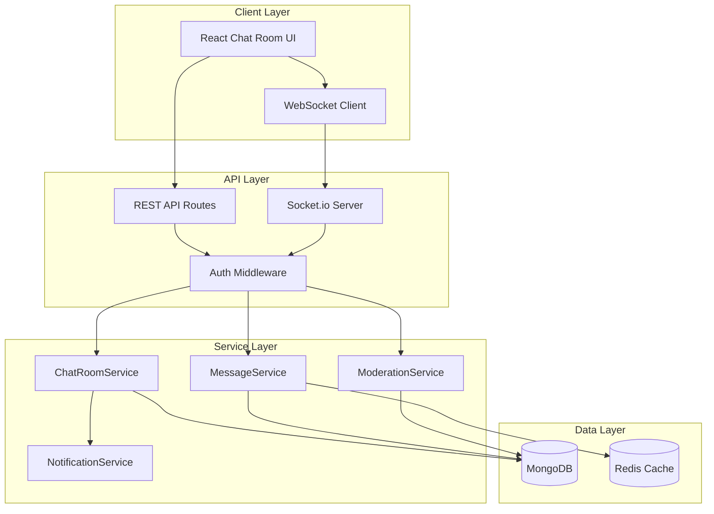
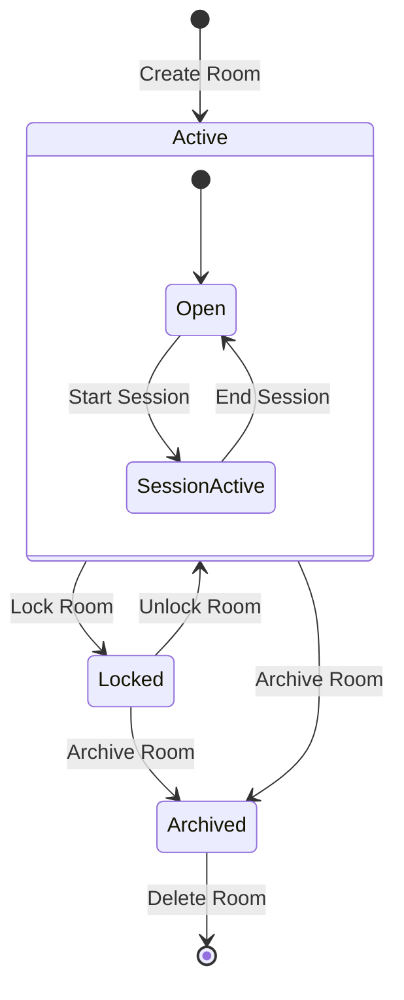
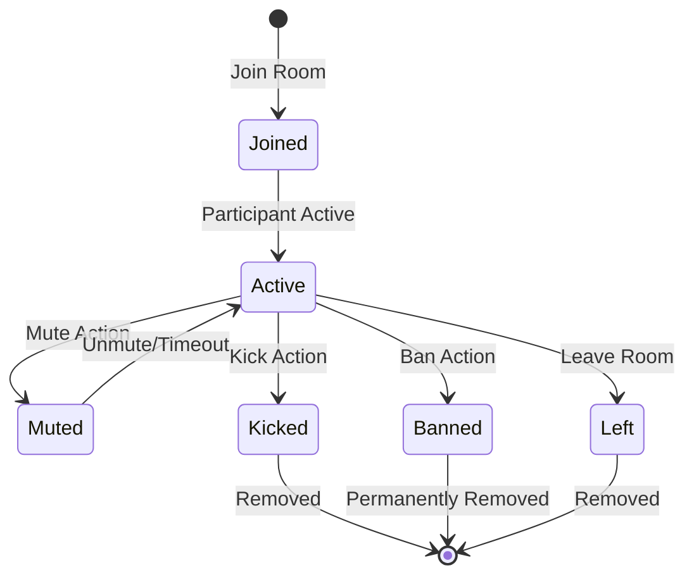

# Design Document: Chat Room Feature

## Overview

The Chat Room feature enables group-based communication within Smiling Steps, providing a platform for peer support groups, group therapy sessions, and community discussions. The system leverages Socket.io for real-time messaging, MongoDB for data persistence, and integrates with the existing authentication and notification systems.

## Architecture



## Components and Interfaces

### 1. ChatRoom Model

```javascript
// server/models/ChatRoom.js
const ChatRoomSchema = new mongoose.Schema({
  name: { type: String, required: true, maxlength: 100 },
  description: { type: String, maxlength: 500 },
  roomType: { 
    type: String, 
    enum: ['support_group', 'therapy_group', 'community', 'private'],
    required: true 
  },
  owner: { type: mongoose.Schema.Types.ObjectId, ref: 'User', required: true },
  moderators: [{ type: mongoose.Schema.Types.ObjectId, ref: 'User' }],
  participants: [{
    user: { type: mongoose.Schema.Types.ObjectId, ref: 'User' },
    joinedAt: { type: Date, default: Date.now },
    role: { type: String, enum: ['participant', 'moderator', 'owner'], default: 'participant' },
    isMuted: { type: Boolean, default: false },
    mutedUntil: Date,
    notificationsEnabled: { type: Boolean, default: true }
  }],
  bannedUsers: [{
    user: { type: mongoose.Schema.Types.ObjectId, ref: 'User' },
    bannedAt: Date,
    bannedBy: { type: mongoose.Schema.Types.ObjectId, ref: 'User' },
    reason: String
  }],
  settings: {
    maxParticipants: { type: Number, default: 50, min: 1, max: 100 },
    isJoinable: { type: Boolean, default: true },
    isPublic: { type: Boolean, default: true },
    messageRetentionDays: { type: Number, default: 90 },
    allowFileSharing: { type: Boolean, default: false }
  },
  scheduledSessions: [{
    title: String,
    startTime: Date,
    endTime: Date,
    isActive: { type: Boolean, default: false },
    createdBy: { type: mongoose.Schema.Types.ObjectId, ref: 'User' }
  }],
  lastActivity: { type: Date, default: Date.now },
  messageCount: { type: Number, default: 0 },
  isActive: { type: Boolean, default: true },
  createdAt: { type: Date, default: Date.now }
});
```

### 2. RoomMessage Model

```javascript
// server/models/RoomMessage.js
const RoomMessageSchema = new mongoose.Schema({
  room: { type: mongoose.Schema.Types.ObjectId, ref: 'ChatRoom', required: true, index: true },
  sender: { type: mongoose.Schema.Types.ObjectId, ref: 'User', required: true },
  content: { type: String, required: true, maxlength: 2000 },
  messageType: { 
    type: String, 
    enum: ['text', 'system', 'announcement'],
    default: 'text'
  },
  mentions: [{ type: mongoose.Schema.Types.ObjectId, ref: 'User' }],
  isDeleted: { type: Boolean, default: false },
  deletedBy: { type: mongoose.Schema.Types.ObjectId, ref: 'User' },
  deletedAt: Date,
  editedAt: Date,
  readBy: [{
    user: { type: mongoose.Schema.Types.ObjectId, ref: 'User' },
    readAt: Date
  }],
  createdAt: { type: Date, default: Date.now, index: true }
});

// Compound index for efficient message retrieval
RoomMessageSchema.index({ room: 1, createdAt: -1 });
RoomMessageSchema.index({ room: 1, content: 'text' }); // Text search index
```

### 3. ModerationLog Model

```javascript
// server/models/ModerationLog.js
const ModerationLogSchema = new mongoose.Schema({
  room: { type: mongoose.Schema.Types.ObjectId, ref: 'ChatRoom', required: true },
  moderator: { type: mongoose.Schema.Types.ObjectId, ref: 'User', required: true },
  targetUser: { type: mongoose.Schema.Types.ObjectId, ref: 'User' },
  targetMessage: { type: mongoose.Schema.Types.ObjectId, ref: 'RoomMessage' },
  action: { 
    type: String, 
    enum: ['mute', 'unmute', 'kick', 'ban', 'unban', 'delete_message', 'edit_settings'],
    required: true 
  },
  reason: String,
  duration: Number, // in minutes, for mute actions
  metadata: mongoose.Schema.Types.Mixed,
  createdAt: { type: Date, default: Date.now }
});
```

### 4. ChatRoomService

```javascript
// server/services/chatRoomService.js
class ChatRoomService {
  // Room Management
  async createRoom(ownerId, roomData)
  async updateRoom(roomId, userId, updates)
  async deleteRoom(roomId, userId)
  async getRoomById(roomId, userId)
  async listPublicRooms(filters, pagination)
  async getUserRooms(userId)
  
  // Participant Management
  async joinRoom(roomId, userId)
  async leaveRoom(roomId, userId)
  async getParticipants(roomId)
  async updateParticipantRole(roomId, moderatorId, targetUserId, newRole)
  
  // Moderation
  async muteParticipant(roomId, moderatorId, targetUserId, duration, reason)
  async unmuteParticipant(roomId, moderatorId, targetUserId)
  async kickParticipant(roomId, moderatorId, targetUserId, reason)
  async banParticipant(roomId, moderatorId, targetUserId, reason)
  async unbanParticipant(roomId, moderatorId, targetUserId)
  
  // Scheduled Sessions
  async scheduleSession(roomId, userId, sessionData)
  async cancelSession(roomId, userId, sessionId, reason)
  async startSession(roomId, sessionId)
  async endSession(roomId, sessionId)
}
```

### 5. MessageService

```javascript
// server/services/roomMessageService.js
class RoomMessageService {
  async sendMessage(roomId, senderId, content, mentions)
  async deleteMessage(messageId, userId)
  async getMessages(roomId, userId, options) // pagination, before/after cursor
  async searchMessages(roomId, userId, searchTerm, options)
  async markAsRead(roomId, userId, messageIds)
  async getUnreadCount(roomId, userId)
  async exportChatHistory(roomId, userId, dateRange)
}
```

### 6. Socket.io Events

```javascript
// Real-time event structure
const SOCKET_EVENTS = {
  // Client -> Server
  JOIN_ROOM: 'room:join',
  LEAVE_ROOM: 'room:leave',
  SEND_MESSAGE: 'room:message:send',
  TYPING_START: 'room:typing:start',
  TYPING_STOP: 'room:typing:stop',
  MARK_READ: 'room:messages:read',
  
  // Server -> Client
  MESSAGE_NEW: 'room:message:new',
  MESSAGE_DELETED: 'room:message:deleted',
  PARTICIPANT_JOINED: 'room:participant:joined',
  PARTICIPANT_LEFT: 'room:participant:left',
  PARTICIPANT_MUTED: 'room:participant:muted',
  PARTICIPANT_KICKED: 'room:participant:kicked',
  TYPING_INDICATOR: 'room:typing:update',
  ROOM_UPDATED: 'room:updated',
  SESSION_STARTED: 'room:session:started',
  SESSION_ENDED: 'room:session:ended',
  ERROR: 'room:error'
};
```

## Data Models

### Room State Machine



### Participant State Machine



## API Endpoints

### Room Management

| Method | Endpoint | Description |
|--------|----------|-------------|
| POST | `/api/chat-rooms` | Create a new chat room |
| GET | `/api/chat-rooms` | List available rooms |
| GET | `/api/chat-rooms/:id` | Get room details |
| PUT | `/api/chat-rooms/:id` | Update room settings |
| DELETE | `/api/chat-rooms/:id` | Delete/archive room |
| GET | `/api/chat-rooms/my-rooms` | Get user's rooms |

### Participant Management

| Method | Endpoint | Description |
|--------|----------|-------------|
| POST | `/api/chat-rooms/:id/join` | Join a room |
| POST | `/api/chat-rooms/:id/leave` | Leave a room |
| GET | `/api/chat-rooms/:id/participants` | List participants |
| PUT | `/api/chat-rooms/:id/participants/:userId/role` | Update participant role |

### Messaging

| Method | Endpoint | Description |
|--------|----------|-------------|
| GET | `/api/chat-rooms/:id/messages` | Get message history |
| POST | `/api/chat-rooms/:id/messages` | Send message (REST fallback) |
| DELETE | `/api/chat-rooms/:id/messages/:messageId` | Delete message |
| GET | `/api/chat-rooms/:id/messages/search` | Search messages |
| POST | `/api/chat-rooms/:id/messages/export` | Export chat history |

### Moderation

| Method | Endpoint | Description |
|--------|----------|-------------|
| POST | `/api/chat-rooms/:id/mute/:userId` | Mute participant |
| POST | `/api/chat-rooms/:id/unmute/:userId` | Unmute participant |
| POST | `/api/chat-rooms/:id/kick/:userId` | Kick participant |
| POST | `/api/chat-rooms/:id/ban/:userId` | Ban participant |
| POST | `/api/chat-rooms/:id/unban/:userId` | Unban participant |
| GET | `/api/chat-rooms/:id/moderation-logs` | Get moderation history |

### Scheduled Sessions

| Method | Endpoint | Description |
|--------|----------|-------------|
| POST | `/api/chat-rooms/:id/sessions` | Schedule a session |
| PUT | `/api/chat-rooms/:id/sessions/:sessionId` | Update session |
| DELETE | `/api/chat-rooms/:id/sessions/:sessionId` | Cancel session |
| POST | `/api/chat-rooms/:id/sessions/:sessionId/start` | Start session |
| POST | `/api/chat-rooms/:id/sessions/:sessionId/end` | End session |


## Correctness Properties

*A property is a characteristic or behavior that should hold true across all valid executions of a system—essentially, a formal statement about what the system should do. Properties serve as the bridge between human-readable specifications and machine-verifiable correctness guarantees.*

### Property 1: Room Creation Sets Owner Correctly

*For any* valid psychologist user and room data, when a room is created, the creating psychologist should be set as the room owner.

**Validates: Requirements 1.1**

### Property 2: Room Creation Requires All Fields

*For any* room creation request missing name, description, or roomType, the creation should be rejected with a validation error.

**Validates: Requirements 1.2**

### Property 3: Room IDs Are Unique

*For any* set of created rooms, all room identifiers should be unique (no two rooms share the same ID).

**Validates: Requirements 1.3**

### Property 4: Private Rooms Require Invitation

*For any* private room and any non-invited user, attempting to join should be rejected.

**Validates: Requirements 1.4**

### Property 5: Public Room Visibility

*For any* client user browsing rooms, only rooms with roomType 'community' or isPublic=true should be visible.

**Validates: Requirements 2.1**

### Property 6: Participant Limit Enforcement

*For any* room with a participant limit, when the limit is reached, additional join requests should be rejected.

**Validates: Requirements 2.3**

### Property 7: Ban Prevents Rejoin

*For any* banned user and the room they were banned from, all subsequent join attempts should be rejected.

**Validates: Requirements 2.5, 4.4**

### Property 8: Message Contains Required Fields

*For any* sent message, the message object should contain sender, timestamp, and content fields.

**Validates: Requirements 3.2**

### Property 9: Messages Are Chronologically Ordered

*For any* room with multiple messages, retrieving messages should return them in chronological order (oldest to newest or newest to oldest based on query).

**Validates: Requirements 3.6**

### Property 10: Mute Prevents Messaging

*For any* muted participant, attempting to send a message should be rejected until unmuted or mute duration expires.

**Validates: Requirements 4.1**

### Property 11: Mute/Unmute Round Trip

*For any* participant, muting and then immediately unmuting should restore their ability to send messages.

**Validates: Requirements 4.1, 4.2**

### Property 12: Kick Removes Participant

*For any* kicked participant, they should no longer appear in the room's participant list after the kick action.

**Validates: Requirements 4.3**

### Property 13: Message Deletion Hides Content

*For any* deleted message, subsequent message retrievals should either not include the message or mark it as deleted.

**Validates: Requirements 4.5**

### Property 14: Moderation Actions Are Logged

*For any* moderation action (mute, kick, ban, delete), a log entry should be created containing moderator, target, action type, reason, and timestamp.

**Validates: Requirements 4.6**

### Property 15: Settings Updates Apply Immediately

*For any* room settings update by the owner, subsequent room queries should reflect the new settings.

**Validates: Requirements 5.1**

### Property 16: Participant Limit Bounds

*For any* room configuration, participant limits should be constrained between 1 and 100 inclusive.

**Validates: Requirements 5.2**

### Property 17: Joinable Toggle Works

*For any* room with isJoinable=false, new join requests should be rejected.

**Validates: Requirements 5.3**

### Property 18: Moderator Can Moderate

*For any* user assigned as moderator, they should be able to perform mute, kick, and delete message actions.

**Validates: Requirements 5.5**

### Property 19: Owner Leave Transfers Ownership

*For any* room where the owner leaves and moderators exist, ownership should transfer to the oldest moderator.

**Validates: Requirements 5.6**

### Property 20: Leave Removes From Participant List

*For any* participant who leaves a room, they should no longer appear in the participant list.

**Validates: Requirements 6.1**

### Property 21: Unread Count Accuracy

*For any* participant with unread messages, the unread count should equal the number of messages sent after their last read timestamp.

**Validates: Requirements 6.5**

### Property 22: Message Pagination Works

*For any* room with more messages than the page size, pagination should return correct batches without duplicates or missing messages.

**Validates: Requirements 7.1**

### Property 23: Search Returns Matching Messages

*For any* search query, all returned messages should contain the search term in their content.

**Validates: Requirements 7.2**

### Property 24: Private Room Message Visibility

*For any* private room participant, they should only see messages sent after their join time.

**Validates: Requirements 7.4**

### Property 25: Authentication Required

*For any* room operation without valid authentication, the request should be rejected with 401 status.

**Validates: Requirements 9.1**

### Property 26: Permission Validation

*For any* room action requiring specific permissions (owner, moderator), users without those permissions should be rejected.

**Validates: Requirements 9.2**

### Property 27: Non-Participant Cannot View Messages

*For any* user not in a room's participant list, attempting to retrieve messages should be rejected.

**Validates: Requirements 9.4**

### Property 28: Rate Limiting Enforced

*For any* user sending more than 10 messages per minute, subsequent messages should be rejected until the rate limit window resets.

**Validates: Requirements 9.6**

### Property 29: Scheduled Session Creates Event

*For any* scheduled session, a room event should be created with start time, end time, and title.

**Validates: Requirements 10.1**

### Property 30: Session Start Changes Room State

*For any* started session, the room should be marked as having an active session.

**Validates: Requirements 10.2**

## Error Handling

### Error Categories

| Category | HTTP Status | Description |
|----------|-------------|-------------|
| ValidationError | 400 | Invalid input data |
| AuthenticationError | 401 | Missing or invalid token |
| AuthorizationError | 403 | Insufficient permissions |
| NotFoundError | 404 | Room or message not found |
| ConflictError | 409 | Duplicate room name, already joined |
| RateLimitError | 429 | Too many requests |
| ServerError | 500 | Internal server error |

### Error Response Format

```javascript
{
  success: false,
  error: {
    code: 'ROOM_FULL',
    message: 'Cannot join room: participant limit reached',
    details: {
      roomId: '...',
      currentCount: 50,
      maxParticipants: 50
    }
  }
}
```

### Specific Error Codes

- `ROOM_NOT_FOUND` - Room does not exist
- `ROOM_FULL` - Participant limit reached
- `ROOM_CLOSED` - Room is not accepting new members
- `USER_BANNED` - User is banned from this room
- `USER_MUTED` - User is currently muted
- `NOT_PARTICIPANT` - User is not a room participant
- `NOT_MODERATOR` - User lacks moderator permissions
- `NOT_OWNER` - User lacks owner permissions
- `INVALID_ROOM_TYPE` - Invalid room type specified
- `MESSAGE_TOO_LONG` - Message exceeds 2000 character limit
- `RATE_LIMITED` - Too many messages sent

## Testing Strategy

### Unit Tests

Unit tests will verify individual service methods and validation logic:

- ChatRoomService methods (create, join, leave, update)
- MessageService methods (send, delete, search)
- ModerationService methods (mute, kick, ban)
- Input validation for all endpoints
- Permission checking logic

### Property-Based Tests

Property-based tests will use fast-check to verify correctness properties:

- Room creation invariants (owner set, unique ID)
- Participant management (join/leave, limits, bans)
- Message ordering and pagination
- Moderation action effects
- Permission enforcement

**Configuration:**
- Minimum 100 iterations per property test
- Use fast-check for JavaScript property testing
- Tag format: **Feature: chat-room-feature, Property {number}: {property_text}**

### Integration Tests

Integration tests will verify end-to-end flows:

- Complete room lifecycle (create → join → message → leave)
- Moderation workflow (mute → unmute, kick, ban)
- Real-time messaging via Socket.io
- Scheduled session workflow

### Test File Structure

```
server/test/
├── chat-room.property.test.js      # Property-based tests
├── chat-room.unit.test.js          # Unit tests
├── chat-room.integration.test.js   # Integration tests
└── chat-room-socket.test.js        # WebSocket tests
```
