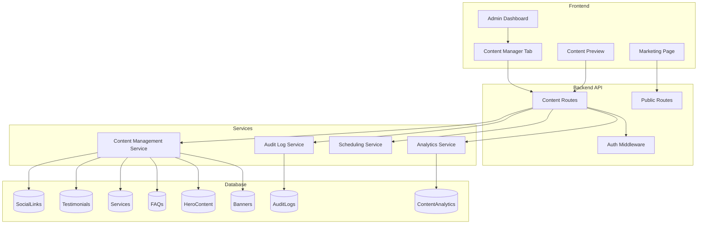

# Design Document: Social Media Management

## Overview

This design document specifies the architecture and implementation details for the Social Media Management feature. The feature enables administrators to manage and customize content displayed on the "Learn More" (Marketing) page through the Admin Dashboard, including social media links, testimonials, services, FAQs, hero content, and promotional banners.

## Architecture



## Components and Interfaces

### Backend Components

#### 1. Content Routes (`/api/admin/content`)

```javascript
// Social Links
// GET /api/admin/content/social-links - List all social links
// POST /api/admin/content/social-links - Create social link
// PUT /api/admin/content/social-links/:id - Update social link
// DELETE /api/admin/content/social-links/:id - Delete social link
// PUT /api/admin/content/social-links/:id/toggle - Toggle active status

// Testimonials
// GET /api/admin/content/testimonials - List all testimonials
// POST /api/admin/content/testimonials - Create testimonial
// PUT /api/admin/content/testimonials/:id - Update testimonial
// DELETE /api/admin/content/testimonials/:id - Delete testimonial
// PUT /api/admin/content/testimonials/reorder - Update display order

// Services
// GET /api/admin/content/services - List all services
// POST /api/admin/content/services - Create service
// PUT /api/admin/content/services/:id - Update service
// DELETE /api/admin/content/services/:id - Delete service
// PUT /api/admin/content/services/reorder - Update display order

// FAQs
// GET /api/admin/content/faqs - List all FAQs
// POST /api/admin/content/faqs - Create FAQ
// PUT /api/admin/content/faqs/:id - Update FAQ
// DELETE /api/admin/content/faqs/:id - Delete FAQ
// PUT /api/admin/content/faqs/reorder - Update display order

// Hero Section
// GET /api/admin/content/hero - Get hero content
// PUT /api/admin/content/hero - Update hero content
// POST /api/admin/content/hero/images - Upload hero image
// DELETE /api/admin/content/hero/images/:id - Delete hero image
// PUT /api/admin/content/hero/images/reorder - Reorder hero images

// Banners
// GET /api/admin/content/banners - List all banners
// POST /api/admin/content/banners - Create banner
// PUT /api/admin/content/banners/:id - Update banner
// DELETE /api/admin/content/banners/:id - Delete banner

// Preview
// GET /api/admin/content/preview - Get preview of all content with pending changes

// Analytics
// GET /api/admin/content/analytics - Get content analytics
// GET /api/admin/content/analytics/export - Export analytics as CSV

// Scheduling
// GET /api/admin/content/scheduled - List scheduled content changes
// DELETE /api/admin/content/scheduled/:id - Cancel scheduled change
```

#### 2. Public Content Routes (`/api/public/content`)

```javascript
// GET /api/public/content/marketing - Get all active marketing page content
{
  socialLinks: SocialLink[],
  testimonials: Testimonial[],
  services: Service[],
  faqs: FAQ[],
  hero: HeroContent,
  banners: Banner[]
}
```

### Frontend Components

#### 1. Content Manager Tab (Admin Dashboard)

```javascript
// ContentManagerTab.js - Main container with sub-tabs
const ContentManagerTab = () => {
  // Sub-tabs: Social Links, Testimonials, Services, FAQs, Hero, Banners, Analytics
};
```

#### 2. Content Management Components

- `SocialLinksManager.js` - CRUD for social media links
- `TestimonialsManager.js` - CRUD for testimonials with drag-drop reorder
- `ServicesManager.js` - CRUD for services with icon/color picker
- `FAQManager.js` - CRUD for FAQs with category management
- `HeroSectionManager.js` - Edit hero content and manage slideshow images
- `BannersManager.js` - CRUD for promotional banners with date pickers
- `ContentAnalytics.js` - View and export content analytics
- `ContentPreview.js` - Preview marketing page with pending changes

## Data Models

### SocialLink Model

```javascript
const socialLinkSchema = {
  platform: { 
    type: String, 
    enum: ['facebook', 'twitter', 'instagram', 'linkedin', 'youtube', 'tiktok'],
    required: true 
  },
  url: { type: String, required: true },
  displayOrder: { type: Number, default: 0 },
  isActive: { type: Boolean, default: true },
  createdAt: { type: Date, default: Date.now },
  updatedAt: Date,
  createdBy: { type: ObjectId, ref: 'User' },
  updatedBy: { type: ObjectId, ref: 'User' }
};
```

### Testimonial Model

```javascript
const testimonialSchema = {
  clientName: { type: String, required: true },
  clientRole: String,
  content: { type: String, required: true, maxLength: 500 },
  rating: { type: Number, min: 1, max: 5, required: true },
  avatarUrl: String,
  displayOrder: { type: Number, default: 0 },
  isPublished: { type: Boolean, default: false },
  scheduledPublishDate: Date,
  createdAt: { type: Date, default: Date.now },
  updatedAt: Date,
  createdBy: { type: ObjectId, ref: 'User' },
  updatedBy: { type: ObjectId, ref: 'User' }
};
```

### Service Model

```javascript
const serviceSchema = {
  title: { type: String, required: true },
  description: { type: String, required: true },
  icon: { type: String, required: true }, // MUI icon name
  colorTheme: { type: String, default: '#663399' },
  features: [String],
  displayOrder: { type: Number, default: 0 },
  isActive: { type: Boolean, default: true },
  scheduledPublishDate: Date,
  createdAt: { type: Date, default: Date.now },
  updatedAt: Date,
  createdBy: { type: ObjectId, ref: 'User' },
  updatedBy: { type: ObjectId, ref: 'User' }
};
```

### FAQ Model

```javascript
const faqSchema = {
  question: { type: String, required: true },
  answer: { type: String, required: true },
  category: { type: String, default: 'General' },
  displayOrder: { type: Number, default: 0 },
  isPublished: { type: Boolean, default: false },
  scheduledPublishDate: Date,
  expandCount: { type: Number, default: 0 }, // Analytics
  createdAt: { type: Date, default: Date.now },
  updatedAt: Date,
  createdBy: { type: ObjectId, ref: 'User' },
  updatedBy: { type: ObjectId, ref: 'User' }
};
```

### HeroContent Model

```javascript
const heroContentSchema = {
  title: { type: String, required: true },
  subtitle: String,
  tagline: String,
  ctaButtons: [{
    text: String,
    link: String,
    style: { type: String, enum: ['primary', 'secondary', 'outlined'] }
  }],
  images: [{
    url: String,
    alt: String,
    displayOrder: Number
  }],
  updatedAt: Date,
  updatedBy: { type: ObjectId, ref: 'User' }
};
```

### Banner Model

```javascript
const bannerSchema = {
  title: { type: String, required: true },
  message: { type: String, required: true },
  link: String,
  backgroundColor: { type: String, default: '#663399' },
  textColor: { type: String, default: '#FFFFFF' },
  position: { type: String, enum: ['top', 'bottom'], default: 'top' },
  startDate: { type: Date, required: true },
  endDate: { type: Date, required: true },
  isActive: { type: Boolean, default: true },
  createdAt: { type: Date, default: Date.now },
  updatedAt: Date,
  createdBy: { type: ObjectId, ref: 'User' },
  updatedBy: { type: ObjectId, ref: 'User' }
};
```

### ContentAnalytics Model

```javascript
const contentAnalyticsSchema = {
  contentType: { type: String, enum: ['testimonial', 'service', 'faq', 'banner', 'post'] },
  contentId: ObjectId,
  eventType: { type: String, enum: ['view', 'click', 'expand', 'share'] },
  timestamp: { type: Date, default: Date.now },
  sessionId: String,
  userAgent: String
};
```

### MarketingPost Model

```javascript
const marketingPostSchema = {
  title: { type: String, required: true },
  slug: { type: String, unique: true },
  content: { type: String, required: true }, // Rich text HTML
  excerpt: { type: String, maxLength: 300 },
  featuredImage: {
    url: String,
    alt: String
  },
  gallery: [{
    url: String,
    alt: String,
    caption: String
  }],
  category: { type: String, default: 'General' },
  tags: [String],
  isPublished: { type: Boolean, default: false },
  publishedAt: Date,
  scheduledPublishDate: Date,
  viewCount: { type: Number, default: 0 },
  shareCount: { type: Number, default: 0 },
  socialShares: [{
    platform: String,
    postUrl: String,
    sharedAt: Date
  }],
  createdAt: { type: Date, default: Date.now },
  updatedAt: Date,
  createdBy: { type: ObjectId, ref: 'User' },
  updatedBy: { type: ObjectId, ref: 'User' }
};
```

### SocialAccount Model

```javascript
const socialAccountSchema = {
  platform: { 
    type: String, 
    enum: ['facebook', 'twitter', 'instagram', 'linkedin', 'tiktok', 'youtube'],
    required: true 
  },
  accountName: String,
  accountId: String,
  accessToken: { type: String, select: false }, // Encrypted
  refreshToken: { type: String, select: false }, // Encrypted
  tokenExpiresAt: Date,
  isConnected: { type: Boolean, default: true },
  lastUsed: Date,
  connectedAt: { type: Date, default: Date.now },
  connectedBy: { type: ObjectId, ref: 'User' }
};
```

### UserNotification Model

```javascript
const userNotificationSchema = {
  title: { type: String, required: true },
  message: { type: String, required: true },
  link: String,
  priority: { type: String, enum: ['low', 'normal', 'high', 'urgent'], default: 'normal' },
  targetAudience: { 
    type: String, 
    enum: ['all', 'clients', 'psychologists', 'specific'],
    default: 'all'
  },
  specificUsers: [{ type: ObjectId, ref: 'User' }],
  sentAt: Date,
  scheduledFor: Date,
  deliveryCount: { type: Number, default: 0 },
  readCount: { type: Number, default: 0 },
  clickCount: { type: Number, default: 0 },
  createdAt: { type: Date, default: Date.now },
  createdBy: { type: ObjectId, ref: 'User' }
};
```

### UserNotificationReceipt Model

```javascript
const userNotificationReceiptSchema = {
  notificationId: { type: ObjectId, ref: 'UserNotification', required: true },
  userId: { type: ObjectId, ref: 'User', required: true },
  isRead: { type: Boolean, default: false },
  readAt: Date,
  isClicked: { type: Boolean, default: false },
  clickedAt: Date,
  deliveredAt: { type: Date, default: Date.now }
};
```

## Correctness Properties

### Property 1: Social Link URL Validation

*For any* social link creation or update request, if the URL does not match a valid URL format for the specified platform, the request SHALL be rejected and no data SHALL be modified.

**Validates: Requirements 1.2**

### Property 2: Social Link Toggle Reflects on Marketing Page

*For any* social link toggle operation, the marketing page content endpoint SHALL return the link if active is true, and SHALL NOT return the link if active is false.

**Validates: Requirements 1.4**

### Property 3: Testimonial Display Order Consistency

*For any* testimonial reorder operation, the testimonials returned by the marketing page endpoint SHALL be sorted by displayOrder in ascending order.

**Validates: Requirements 2.5**

### Property 4: Service Active Status Visibility

*For any* service with isActive set to false, the service SHALL NOT appear in the marketing page content response.

**Validates: Requirements 3.4**

### Property 5: FAQ Publication Status Visibility

*For any* FAQ with isPublished set to false, the FAQ SHALL NOT appear in the marketing page content response.

**Validates: Requirements 4.4**

### Property 6: Banner Date Range Enforcement

*For any* banner, the marketing page SHALL display the banner only when the current date is between startDate and endDate (inclusive), regardless of the isActive flag.

**Validates: Requirements 6.4, 6.5**

### Property 7: Content Audit Trail Completeness

*For any* content creation, update, or deletion operation, an audit log entry SHALL exist with the admin user ID, action type, content type, timestamp, and the old/new values.

**Validates: Requirements 9.1, 9.2, 9.3**

### Property 8: Scheduled Content Auto-Publication

*For any* content with a scheduledPublishDate that has passed, the content SHALL be automatically published (isPublished/isActive set to true) within 1 minute of the scheduled time.

**Validates: Requirements 10.1, 10.2**

### Property 9: Content Preview Accuracy

*For any* preview request, the preview response SHALL include all pending changes that have not yet been published, merged with the current live content.

**Validates: Requirements 7.1, 7.2, 7.3**

### Property 10: Analytics Data Accuracy

*For any* analytics query with a date range, the returned metrics SHALL accurately reflect the sum of all recorded events within that date range.

**Validates: Requirements 8.1, 8.2, 8.3, 8.4**

### Property 11: Marketing Post Image Validation

*For any* image upload request, if the file type is not in the allowed list (jpg, png, gif, webp) or exceeds 10MB, the request SHALL be rejected and no file SHALL be stored.

**Validates: Requirements 11.3**

### Property 12: Social Media Share Logging

*For any* successful social media share operation, a log entry SHALL exist with the platform, post URL, timestamp, and content ID.

**Validates: Requirements 12.4**

### Property 13: Notification Delivery to Target Audience

*For any* notification sent to a target audience, all users matching the audience criteria SHALL receive a notification receipt, and no users outside the criteria SHALL receive one.

**Validates: Requirements 13.3, 13.2**

### Property 14: Notification Read Status Tracking

*For any* notification marked as read by a user, the notification receipt SHALL have isRead set to true and readAt set to the current timestamp.

**Validates: Requirements 13.4**

### Property 15: Scheduled Notification Auto-Send

*For any* notification with a scheduledFor date that has passed, the notification SHALL be automatically sent to all target users within 1 minute of the scheduled time.

**Validates: Requirements 13.5**

## Error Handling

### API Error Responses

```javascript
// Standard error response format
{
  error: string,
  code: string,
  details?: object
}

// Error codes
const ErrorCodes = {
  INVALID_URL: 'INVALID_URL',
  INVALID_PLATFORM: 'INVALID_PLATFORM',
  CONTENT_NOT_FOUND: 'CONTENT_NOT_FOUND',
  INVALID_DATE_RANGE: 'INVALID_DATE_RANGE',
  DUPLICATE_PLATFORM: 'DUPLICATE_PLATFORM',
  INVALID_RATING: 'INVALID_RATING',
  CONTENT_TOO_LONG: 'CONTENT_TOO_LONG'
};
```

### Error Scenarios

1. **Invalid URL Format**: Return 400 with URL validation error
2. **Content Not Found**: Return 404 with content type
3. **Invalid Date Range**: Return 400 when endDate < startDate
4. **Duplicate Platform**: Return 409 when adding duplicate social link platform
5. **Invalid Rating**: Return 400 when rating not between 1-5

## Testing Strategy

### Unit Tests

- Test URL validation for each social platform
- Test date range validation for banners
- Test display order sorting logic
- Test content visibility based on status flags

### Property-Based Tests

Using fast-check library:

```javascript
// Example: Banner date range enforcement
fc.assert(
  fc.property(
    fc.date(),
    fc.date(),
    fc.date(),
    (startDate, endDate, currentDate) => {
      // Create banner, check visibility based on current date
    }
  ),
  { numRuns: 100 }
);
```

### Integration Tests

- Test complete content CRUD workflows
- Test marketing page content aggregation
- Test scheduled content publication
- Test analytics tracking and reporting

### Test Configuration

- Property tests: minimum 100 iterations per property
- Tag format: **Feature: social-media-management, Property {number}: {property_text}**
- Use fast-check for property-based testing
