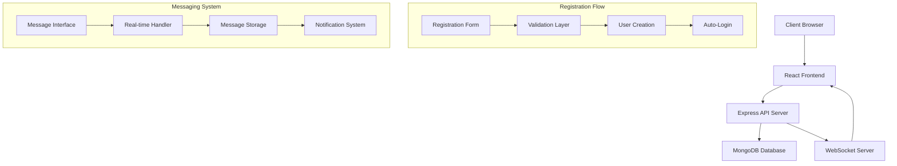

# Design Document

## Overview

This design document outlines the implementation of a streamlined client registration system that bypasses email verification for immediate platform access, coupled with enhanced real-time messaging capabilities. The solution builds upon the existing Smiling Steps platform architecture while introducing simplified registration flows and robust messaging features.

## Architecture

### System Architecture
The solution follows the existing MERN stack architecture:
- **Frontend**: React 18+ with Material-UI components
- **Backend**: Node.js with Express.js framework
- **Database**: MongoDB with Mongoose ODM
- **Authentication**: JWT tokens with 24-hour expiration
- **Real-time Communication**: WebSocket integration for live messaging

### High-Level Component Interaction


## Components and Interfaces

### 1. Registration System Components

#### Frontend Components
- **StreamlinedRegisterForm**: Simplified registration form with minimal fields
- **RegistrationValidation**: Client-side validation for immediate feedback
- **AutoLoginHandler**: Automatic login after successful registration

#### Backend Components
- **RegistrationController**: Handles registration requests without email verification
- **UserValidator**: Server-side validation for registration data
- **AutoApprovalService**: Automatically approves client accounts

#### API Endpoints
```
POST /api/users/register-streamlined
- Body: { name, email, password }
- Response: { success, token, user }
- No email verification required
```

### 2. Enhanced Messaging System Components

#### Frontend Components
- **MessageInterface**: Main chat interface with real-time updates
- **ConversationList**: List of active conversations with unread indicators
- **MessageBubble**: Individual message display component
- **TypingIndicator**: Shows when other party is typing
- **OnlineStatus**: Displays user online/offline status
- **MessageNotifications**: Toast notifications for new messages

#### Backend Components
- **MessageController**: Handles message CRUD operations
- **ConversationManager**: Manages conversation creation and retrieval
- **WebSocketHandler**: Real-time message broadcasting
- **NotificationService**: Push notifications for messages
- **MessageEncryption**: Encrypts messages at rest and in transit

#### API Endpoints
```
GET /api/conversations - Get user's conversations
POST /api/conversations - Create new conversation
GET /api/conversations/:id/messages - Get conversation messages
POST /api/conversations/:id/messages - Send new message
PUT /api/messages/:id/read - Mark message as read
GET /api/users/:id/online-status - Get user online status
```

#### WebSocket Events
```
- message:new - New message received
- message:read - Message read confirmation
- user:typing - User typing indicator
- user:online - User online status change
- conversation:updated - Conversation metadata updated
```

## Data Models

### Enhanced User Model
```javascript
// Existing User model with additional fields
{
  // ... existing fields
  isVerified: { type: Boolean, default: true }, // Auto-verified for streamlined registration
  lastSeen: { type: Date, default: Date.now },
  isOnline: { type: Boolean, default: false },
  messageNotifications: { type: Boolean, default: true }
}
```

### Message Model (Enhanced)
```javascript
{
  conversation: { type: ObjectId, ref: 'Conversation', required: true },
  sender: { type: ObjectId, ref: 'User', required: true },
  text: { type: String, required: true, encrypted: true },
  messageType: { type: String, enum: ['text', 'image', 'file'], default: 'text' },
  isRead: { type: Boolean, default: false },
  readAt: { type: Date },
  deliveredAt: { type: Date, default: Date.now },
  editedAt: { type: Date },
  isDeleted: { type: Boolean, default: false },
  replyTo: { type: ObjectId, ref: 'Message' },
  attachments: [{
    type: String,
    url: String,
    size: Number
  }],
  createdAt: { type: Date, default: Date.now },
  updatedAt: { type: Date, default: Date.now }
}
```

### Conversation Model (Enhanced)
```javascript
{
  client: { type: ObjectId, ref: 'User', required: true },
  psychologist: { type: ObjectId, ref: 'User', required: true },
  assessmentResult: { type: ObjectId, ref: 'AssessmentResult' },
  lastMessage: {
    text: String,
    sender: { type: ObjectId, ref: 'User' },
    timestamp: { type: Date, default: Date.now },
    isRead: Boolean
  },
  unreadCount: {
    client: { type: Number, default: 0 },
    psychologist: { type: Number, default: 0 }
  },
  isActive: { type: Boolean, default: true },
  mutedBy: [{ type: ObjectId, ref: 'User' }],
  createdAt: { type: Date, default: Date.now },
  updatedAt: { type: Date, default: Date.now }
}
```

### OnlineStatus Model (New)
```javascript
{
  user: { type: ObjectId, ref: 'User', required: true, unique: true },
  isOnline: { type: Boolean, default: false },
  lastSeen: { type: Date, default: Date.now },
  socketId: String,
  deviceInfo: {
    type: String,
    browser: String,
    os: String
  },
  updatedAt: { type: Date, default: Date.now }
}
```

## Error Handling

### Registration Error Handling
- **Validation Errors**: Clear field-specific error messages
- **Duplicate Email**: Friendly error with suggestion to login
- **Server Errors**: Generic error message with retry option
- **Network Errors**: Offline detection with retry mechanism

### Messaging Error Handling
- **Connection Errors**: Automatic reconnection with exponential backoff
- **Message Delivery Failures**: Retry mechanism with failure indicators
- **Encryption Errors**: Fallback to unencrypted with user consent
- **Rate Limiting**: Graceful handling with user feedback

### Error Response Format
```javascript
{
  success: false,
  error: {
    code: 'VALIDATION_ERROR',
    message: 'User-friendly error message',
    details: {
      field: 'Specific field error'
    }
  }
}
```

## Testing Strategy

### Unit Testing
- **Registration Components**: Form validation, API calls, error handling
- **Message Components**: Message rendering, real-time updates, encryption
- **Backend Services**: User creation, message handling, WebSocket events
- **Database Models**: Data validation, relationships, indexes

### Integration Testing
- **Registration Flow**: End-to-end registration without email verification
- **Messaging Flow**: Complete message sending and receiving cycle
- **Real-time Features**: WebSocket connection and event handling
- **Cross-browser Compatibility**: Testing across different browsers

### Performance Testing
- **Message Loading**: Large conversation history performance
- **Real-time Scalability**: Multiple concurrent users messaging
- **Database Queries**: Optimized queries for conversations and messages
- **WebSocket Performance**: Connection handling under load

### Security Testing
- **Input Validation**: SQL injection, XSS prevention
- **Authentication**: JWT token security and expiration
- **Message Encryption**: End-to-end encryption verification
- **Rate Limiting**: API abuse prevention

## Security Considerations

### Registration Security
- **Input Sanitization**: Prevent XSS and injection attacks
- **Rate Limiting**: Prevent registration spam
- **Password Security**: Bcrypt hashing with salt rounds
- **Account Verification**: Optional email verification for enhanced security

### Messaging Security
- **Message Encryption**: AES-256 encryption for message content
- **Transport Security**: HTTPS/WSS for all communications
- **Access Control**: User can only access their own conversations
- **Message Retention**: Configurable message deletion policies
- **Audit Logging**: Track message access and modifications

### Privacy Protection
- **Data Minimization**: Collect only necessary user information
- **GDPR Compliance**: User data deletion and export capabilities
- **Session Management**: Secure session handling and cleanup
- **Third-party Integration**: Minimal external service dependencies

## Performance Optimizations

### Frontend Optimizations
- **Message Virtualization**: Render only visible messages for large conversations
- **Lazy Loading**: Load conversations and messages on demand
- **Caching Strategy**: Cache frequently accessed conversations
- **Debounced Typing**: Reduce typing indicator API calls
- **Optimistic Updates**: Show messages immediately before server confirmation

### Backend Optimizations
- **Database Indexing**: Optimize queries for conversations and messages
- **Connection Pooling**: Efficient database connection management
- **Message Pagination**: Limit message retrieval for performance
- **WebSocket Scaling**: Horizontal scaling for real-time features
- **Caching Layer**: Redis for frequently accessed data

### Real-time Optimizations
- **Event Batching**: Batch multiple events for efficiency
- **Connection Management**: Efficient WebSocket connection handling
- **Heartbeat Mechanism**: Detect and handle disconnections
- **Message Queuing**: Queue messages during disconnections
- **Selective Broadcasting**: Send events only to relevant users