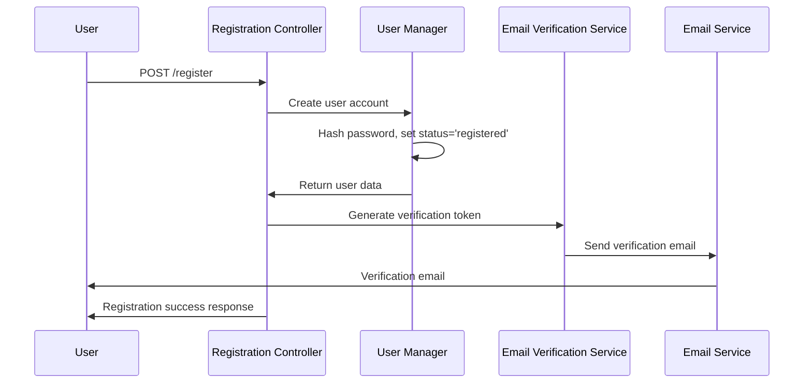
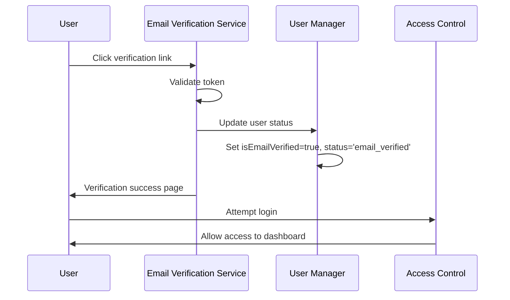

# User Registration & Verification System Design

## Architecture Overview

The User Registration & Verification System consists of several interconnected components that handle secure account creation, email verification, role-based access control, and therapist approval workflows.

### Core Components

1. **Registration Controller** - Handles user registration requests and validation
2. **Email Verification Service** - Manages verification token generation and email sending
3. **User Account Manager** - Manages user account states and role assignments
4. **Therapist Approval Service** - Handles credential submission and approval workflow
5. **Access Control Middleware** - Enforces verification requirements and role-based access

## Data Models

### User Model Extensions

```javascript
// Enhanced User Schema for registration and verification
{
  // Basic user data
  name: String,
  email: String (unique, indexed),
  password: String (hashed),
  role: String (enum: ['client', 'therapist', 'admin']),
  
  // Account status tracking
  accountStatus: String (enum: ['registered', 'email_verified', 'pending_approval', 'approved', 'suspended']),
  isEmailVerified: Boolean,
  emailVerificationToken: String,
  emailVerificationExpires: Date,
  
  // Therapist-specific fields
  therapistDetails: {
    credentials: [{
      type: String,
      documentUrl: String,
      uploadedAt: Date
    }],
    approvalStatus: String (enum: ['pending', 'approved', 'rejected']),
    approvalNotes: String,
    approvedBy: ObjectId,
    approvedAt: Date
  },
  
  // Security and tracking
  registrationDate: Date,
  lastLoginAttempt: Date,
  failedLoginAttempts: Number,
  accountLockedUntil: Date
}
```

### Verification Token Model

```javascript
{
  userId: ObjectId,
  token: String (hashed),
  type: String (enum: ['email_verification', 'password_reset']),
  expiresAt: Date,
  usedAt: Date,
  createdAt: Date
}
```

## API Design

### Registration Endpoints

#### POST /api/auth/register
```javascript
// Request body
{
  name: "John Doe",
  email: "john@example.com",
  password: "securePassword123",
  role: "client" // or "therapist"
}

// Response
{
  success: true,
  message: "Registration successful. Please check your email for verification.",
  user: {
    id: "user_id",
    name: "John Doe",
    email: "john@example.com",
    role: "client",
    accountStatus: "registered",
    isEmailVerified: false
  }
}
```

#### POST /api/auth/verify-email
```javascript
// Request body
{
  token: "verification_token_from_email"
}

// Response
{
  success: true,
  message: "Email verified successfully",
  user: {
    id: "user_id",
    accountStatus: "email_verified",
    isEmailVerified: true
  }
}
```

#### POST /api/auth/resend-verification
```javascript
// Request body
{
  email: "john@example.com"
}

// Response
{
  success: true,
  message: "Verification email sent"
}
```

### Therapist Credential Endpoints

#### POST /api/therapist/submit-credentials
```javascript
// Request body (multipart/form-data)
{
  licenseDocument: File,
  certifications: [File],
  professionalInfo: {
    licenseNumber: "12345",
    specializations: ["CBT", "Anxiety"],
    experience: "5 years"
  }
}

// Response
{
  success: true,
  message: "Credentials submitted for review",
  submissionId: "submission_id"
}
```

## Component Interactions

### Registration Flow Sequence



### Email Verification Flow



## Security Considerations

### Token Security
- Verification tokens are cryptographically secure (32 bytes)
- Tokens are hashed before storage in database
- Tokens expire after 24 hours
- Used tokens are immediately invalidated

### Password Security
- Minimum 8 characters with complexity requirements
- Passwords hashed using bcrypt with salt rounds ≥ 12
- Password change requires email verification

### Access Control
- Unverified users cannot access protected routes
- Role-based middleware enforces appropriate access levels
- Session management with secure JWT tokens

## Email Templates

### Verification Email Template
```html
<!DOCTYPE html>
<html>
<head>
    <title>Verify Your Email - Smiling Steps</title>
</head>
<body>
    <div style="max-width: 600px; margin: 0 auto; font-family: Arial, sans-serif;">
        <h2>Welcome to Smiling Steps!</h2>
        <p>Thank you for registering. Please verify your email address to complete your account setup.</p>
        
        <div style="text-align: center; margin: 30px 0;">
            <a href="{{verificationUrl}}" 
               style="background: #663399; color: white; padding: 15px 30px; text-decoration: none; border-radius: 5px;">
                Verify Email Address
            </a>
        </div>
        
        <p>This link will expire in 24 hours.</p>
        <p>If you didn't create this account, please ignore this email.</p>
    </div>
</body>
</html>
```

## Error Handling

### Registration Errors
- Duplicate email: "An account with this email already exists"
- Invalid email format: "Please provide a valid email address"
- Weak password: "Password must be at least 8 characters with uppercase, lowercase, and numbers"
- Missing required fields: "Please fill in all required fields"

### Verification Errors
- Invalid token: "Invalid verification link. Please request a new one."
- Expired token: "Verification link has expired. Please request a new one."
- Already verified: "This email address has already been verified."

## Performance Considerations

### Database Optimization
- Index on email field for fast user lookups
- Index on verification tokens for quick validation
- Automatic cleanup of expired tokens via TTL indexes

### Email Service Reliability
- Queue-based email sending with retry logic
- Multiple email service provider fallbacks
- Rate limiting to prevent abuse

## Monitoring and Analytics

### Key Metrics
- Registration completion rate
- Email verification rate
- Time to verification
- Therapist approval processing time
- Failed login attempts by unverified users

### Logging Requirements
- All registration attempts (success/failure)
- Email verification events
- Credential submission events
- Security events (failed logins, suspicious activity)

## Testing Strategy

### Unit Tests
- User model validation
- Token generation and validation
- Email template rendering
- Password hashing and verification

### Integration Tests
- Complete registration flow
- Email verification process
- Therapist credential submission
- Access control enforcement

### End-to-End Tests
- User registration journey
- Email verification workflow
- Role-based dashboard access
- Error handling scenarios